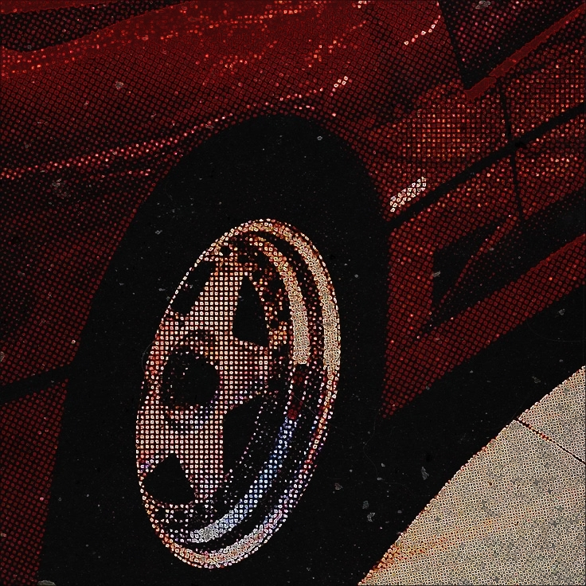
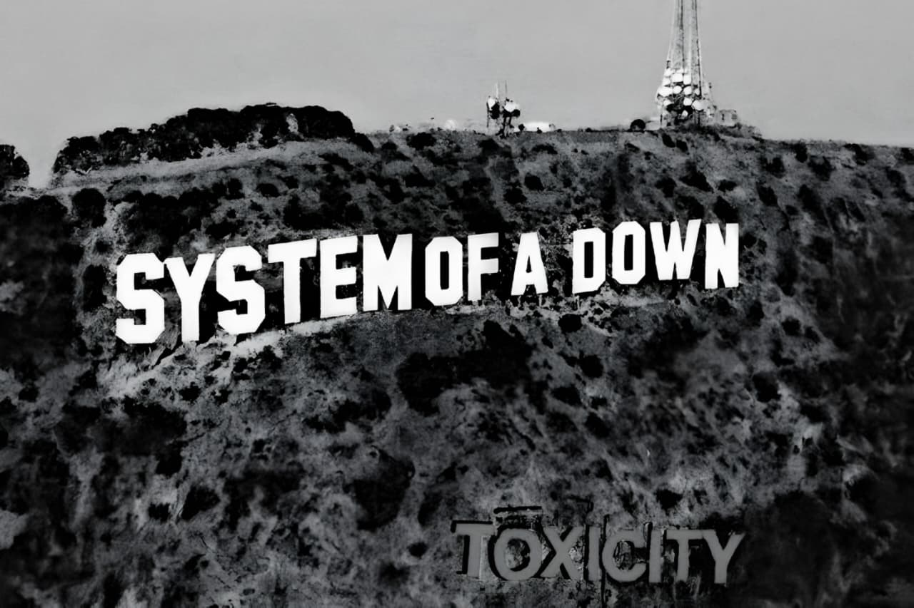

<p align="center">
  
</p>

<div align="center">
  
</div>

<p align="center">
  <sub><sup>S C U D E R I A &nbsp; D E V &nbsp; — &nbsp; L O N D R I N A &nbsp; / &nbsp; P R</sup></sub>
</p>

<br>

<div align="center">


</div>

<br>

<div align="center">

<!-- BADGES — degradê vermelho → escuro → preto -->


<br><br>
<!-- BADGES INVERTIDAS — branco/cinza → vermelho -->


</div>

<br><br>


<h3 align="center"><sub>S O B R E &nbsp; O &nbsp; P I L O T O</sub></h3>

<table align="center">
<tr>
<td width="60%">

```
  nome    →  João Lucas
  base    →  Londrina, PR
  equipe  →  Unicesumar
  motor   →  VSCode
  stack   →  JS · HTML · CSS · Java · C
  foco    →  evolução constante
```

<br>

Estudante de programação e designer gráfico.  
Unindo código com estética, identidade e arte.  
Sempre em movimento.

</td>
<td width="40%" align="center">
  
</td>
</tr>
</table>

<br>

<br>

<h3 align="center"><sub>T E L E M E T R I A</sub></h3>

<div align="center">


</div>

<br>

<div align="center">
  
</div>

<br>

---

<br>

<p align="center">
  
</p>

<br>

<div align="center">
  <sub><i>— why have you forsaken me? —</i></sub>
</div>

<br>

<div align="center">
  
</div>

<br>