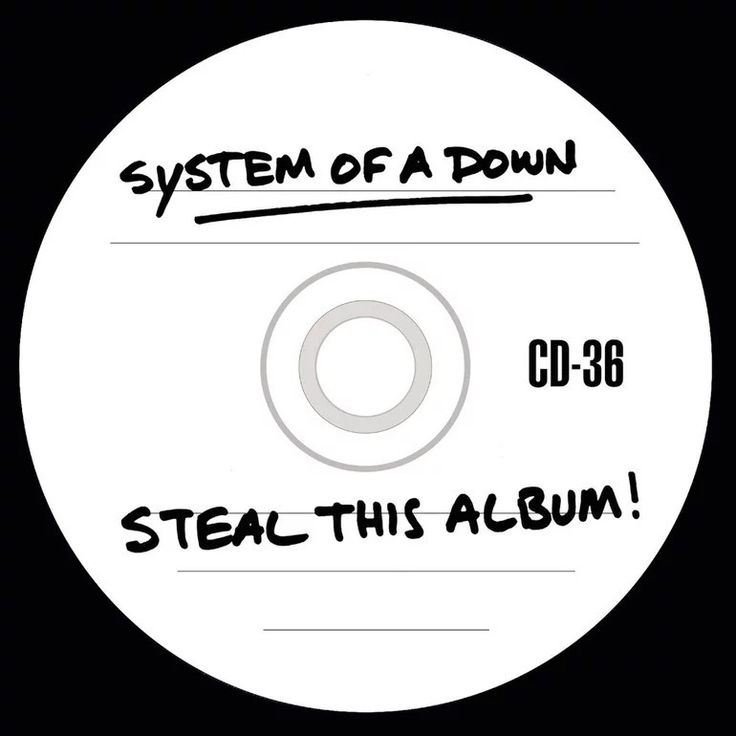

<p align="center">
  
</p>

<p align="center">
  
</p>

<br>

<div align="center">

<!-- BADGES SUPERIORES — degradê Ferrari: vermelho → amarelo → preto -->
<p>
  
  
  
  
  
  
</p>


<!-- BADGES INFERIORES — degradê invertido -->
<p>
  
  
  
  
  
  
</p>

</div>

<br>

---

<br>

<h3 align="center">
  
</h3>

<table align="center">
<tr>
<td width="60%">

```
╔══════════════════════════════╗
║   FICHA TÉCNICA — PILOTO     ║
╠══════════════════════════════╣
║ Nome    → João Lucas         ║
║ Base    → Londrina/PR        ║
║ Equipe  → Unicesumar         ║
║ Motor   → VSCode             ║
║ RPM Max → ∞                  ║
╠══════════════════════════════╣
║ Stack   → JS · HTML · CSS   ║
║          Java · C · Design   ║
╠══════════════════════════════╣
║ Filosofia → Velocidade com   ║
║             identidade.      ║
╚══════════════════════════════╝
```

</td>
<td width="40%" align="center">
  
</td>
</tr>
</table>

<br>

---

<br>

<h3 align="center">
  
</h3>

<div align="center">


</div>

<br>

<div align="center">
  
</div>

<br>

---

<br>

<div align="center">

<!-- Linha decorativa Ferrari -->


<br><br>


<br>


<br><br>

<sub><i>— Why have you forsaken me? —</i></sub>

<br><br>

<!-- Prancheta Ferrari — cavallino rampante ASCII -->


</div>

<br>