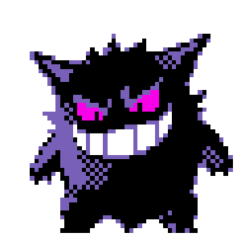
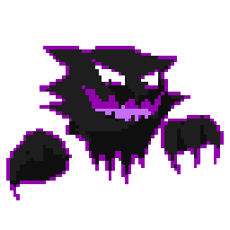

  

  
  
  
  
  

<!-- Titulo -->

#### _"ギラティナ."_

#### Olá! eu sou _João Lucas_

 
  

   

  

  
  

<!-- isso alinha os textos, fazendo ficarem centralizados -->
<h2 align="center"> Sobre mim </h2>

<table align="center">
<tr>

<td width="60%">

Sou um estudante de programação e designer gráfico, buscando evoluir constantemente e transformar conhecimento em prática.
Atualmente gosto de misturar programação com aquilo que me inspira — arte, estética e identidade. Atualmente estudo na Unicesumar - Londrina/PR e utilizo o VSCode como principal ferramenta.
Sigo evoluindo e aplicando conhecimento constantemente.

Seja bem-vindo ao meu GitHub.

</td>

<td width="40%" align="center">

</td>

</tr>
</table>

 

<h3>Estatísticas</h3>

---

  
  

 

  

  <i>ghost of programming.</i>

  

 <i>Isso é tudo por enquanto.</i>

<h2 align="center">📂 Repositórios em destaque:</h2>

