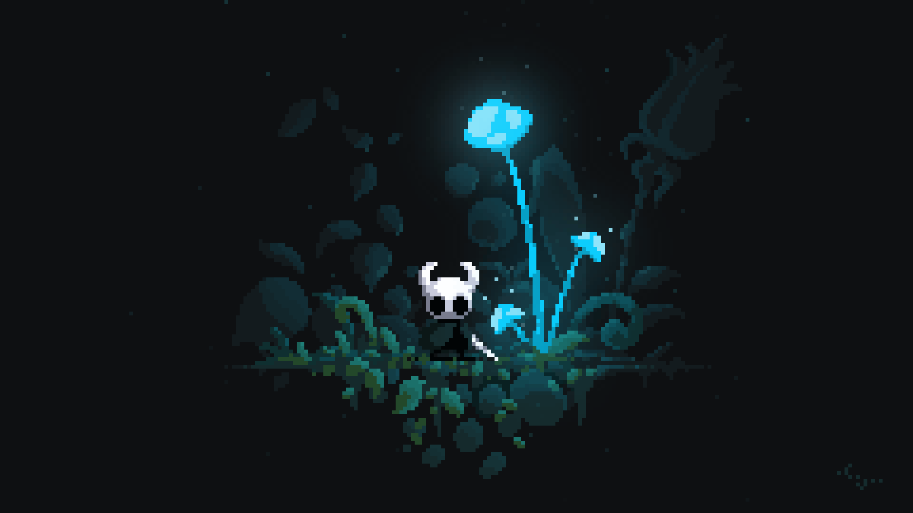

#### _"Em silêncio, eu evoluo."_

#### Olá! eu sou **João Lucas**

## 👨‍💻 Quem eu sou?
Atualmente eu sou um jovem programador (estudante) que busca entrar nesse mercado de programação. Em minha jornada busco me aperfeiçoar mais e mais, colecionando conhecimento e colocando-os em prática, então, bem vindo ao meu Github.

## 🕷️ Tecnologias
Estou estudando atualmente na faculdade Unicesumar - Londrina/Pr, e utilizo como recurso o VSCode (para programar) e o Github para postar meus repositórios, atualmente, sigo aprendendo;

Linguagens   | Status
--------- | ------
Java | Em aprendizagem
Html5| Em aprendizagem
Css | Em aprendizagem
C | Em aprendizagem
      
## 🕸️ _Onde me encontrar_  

 
  

   

  

   

# Repositórios:
