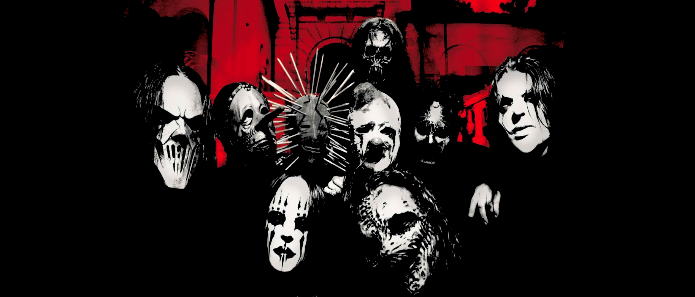
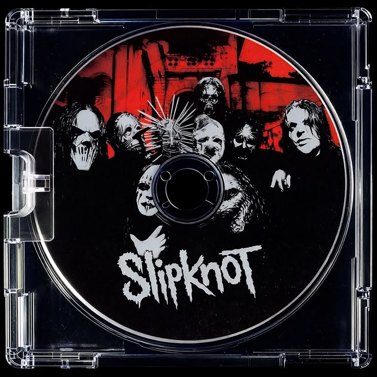
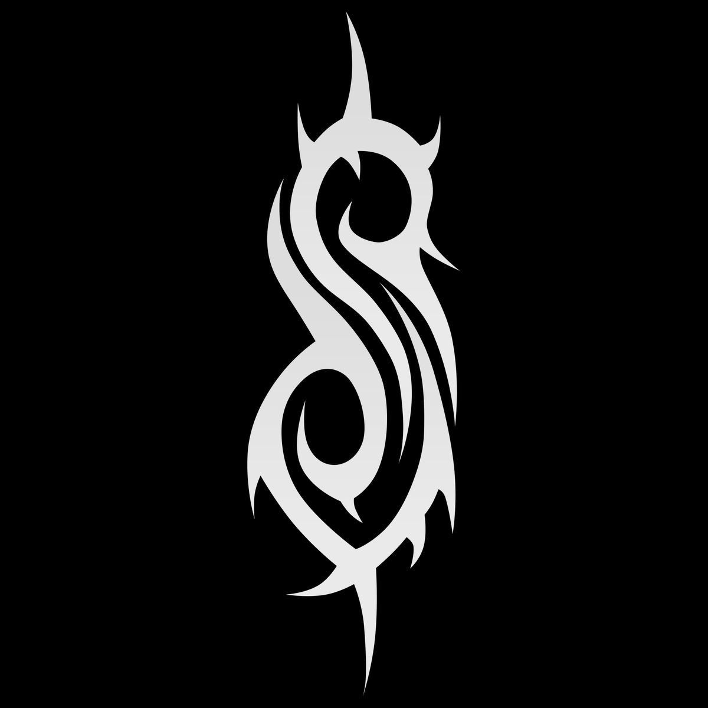
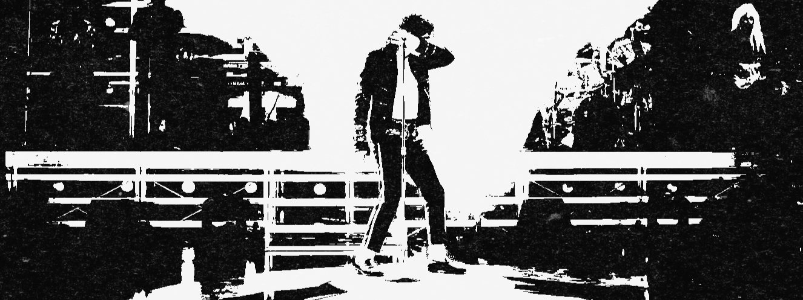

<p align="center">
  
</p>

<div align="center">

</div>
<div align="center">
  
</div>

<!-- PEOPLE+%3D+SHIT;IOWA importante talvez -->
<!--  Fonte passa e volta  -->
<p align="center">
  <sub><sup> S C U D E R I A &nbsp; D E V &nbsp; — &nbsp; L O N D R I N A &nbsp; / &nbsp; P R</sup></sub>
</p>


<br>

<div align="center">


</div>

<h3 align="center"><sub> 𝐒 𝐎 𝐁 𝐑 𝐄 &nbsp; 𝐌 𝐈 𝐌</sub></h3>
<table align="center">
<tr>

<td width="60%">

<p align="left">

Sou um estudante de programação e designer gráfico, buscando evoluir constantemente e transformar conhecimento em prática.
Atualmente gosto de misturar programação com aquilo que me inspira — arte, estética e identidade. Atualmente estudo na Unicesumar - Londrina/PR e utilizo o VSCode como principal ferramenta.
Sigo evoluindo e aplicando conhecimento constantemente.
Seja bem-vindo ao meu GitHub.

</p>

</td>

<td width="40%" align="center">



</td>


</tr>
</table>

<div align="center">


</div>


<div align="center">

<div align="center">

</div>

<br>


</div>

<table align="center" style="border: none;">
<tr style="border: none;">

<td width="60%" style="border: none;">

```
— FREQUÊNCIAS ———————————————————————————————————————————————
  01   Vermilion, Pt.2                          Slipknot     03:34

  𝕭𝖚𝖙 𝕴 𝖜𝖔𝖓'𝖙 𝖑𝖊𝖙 𝖙𝖍𝖎𝖘 𝖇𝖚𝖎𝖑𝖉 𝖚𝖕 𝖎𝖓𝖘𝖎𝖉𝖊 
  𝖔𝖋 𝖒𝖊 𝕴 𝖜𝖔𝖓'𝖙 𝖑𝖊𝖙 𝖙𝖍𝖎𝖘 𝖇𝖚𝖎𝖑𝖉 𝖚𝖕 𝖎𝖓𝖘𝖎𝖉𝖊 
  𝖔𝖋 𝖒𝖊 𝕴 𝖜𝖔𝖓'𝖙 𝖑𝖊𝖙 𝖙𝖍𝖎𝖘 𝖇𝖚𝖎𝖑𝖉 𝖚𝖕 𝖎𝖓𝖘𝖎𝖉𝖊 
  𝖔𝖋 𝖒𝖊 𝕴 𝖜𝖔𝖓'𝖙 𝖑𝖊𝖙 𝖙𝖍𝖎𝖘 𝖇𝖚𝖎𝖑𝖉 𝖚𝖕 𝖎𝖓𝖘𝖎𝖉𝖊 
  𝖔𝖋 𝖒𝖊 𝕴 𝖈𝖆𝖙𝖈𝖍 𝖎𝖓 𝖒𝖞 𝖙𝖍𝖗𝖔𝖆𝖙 𝕮𝖍𝖔𝖐𝖊 𝕿𝖔𝖗𝖓 
  𝖎𝖓𝖙𝖔 𝖕𝖎𝖊𝖈𝖊𝖘 𝕴 𝖜𝖔𝖓'𝖙, 𝖓𝖔 𝕴 𝖉𝖔𝖓'𝖙 𝖜𝖆𝖓𝖙 𝖙𝖔 𝖇𝖊 𝖙𝖍𝖎𝖘
  ─────────────────────────────────────────────────────────
  02   Duality                                  Slipknot    04:12

 𝕴 𝖕𝖚𝖘𝖍 𝖒𝖞 𝖋𝖎𝖓𝖌𝖊𝖗𝖘 𝖎𝖓𝖙𝖔 𝖒𝖞 𝖊𝖞𝖊𝖘 𝕴𝖙'𝖘 𝖙𝖍𝖊 𝖔𝖓𝖑𝖞 𝖙𝖍𝖎𝖓𝖌 𝖙𝖍𝖆𝖙 𝖘𝖑𝖔𝖜𝖑𝖞 𝖘𝖙𝖔𝖕𝖘 𝖙𝖍𝖊 𝖆𝖈𝖍𝖊 𝕭𝖚𝖙 𝖎𝖙'𝖘 𝖒𝖆𝖉𝖊 𝖔𝖋 𝖆𝖑𝖑 𝖙𝖍𝖊 𝖙𝖍𝖎𝖓𝖌𝖘 𝕴 𝖍𝖆𝖛𝖊 𝖙𝖔 𝖙𝖆𝖐𝖊 𝕵𝖊𝖘𝖚𝖘, 𝖎𝖙 𝖓𝖊𝖛𝖊𝖗 𝖊𝖓𝖉𝖘, 𝖎𝖙 𝖜𝖔𝖗𝖐𝖘 𝖎𝖙𝖘 𝖜𝖆𝖞 𝖎𝖓𝖘𝖎𝖉𝖊 𝕴𝖋 𝖙𝖍𝖊 𝖕𝖆𝖎𝖓 𝖌𝖔𝖊𝖘 𝖔𝖓, 𝖔𝖍 𝕴 𝖍𝖆𝖛𝖊 𝖘𝖈𝖗𝖊𝖆𝖒𝖊𝖉 𝖚𝖓𝖙𝖎𝖑 𝖒𝖞 𝖛𝖊𝖎𝖓𝖘 𝖈𝖔𝖑𝖑𝖆𝖕𝖘𝖊𝖉 𝕴 𝖜𝖆𝖎𝖙𝖊𝖉 𝖆𝖘 𝖒𝖞 𝖙𝖎𝖒𝖊'𝖘 𝖊𝖑𝖆𝖕𝖘𝖊𝖉 𝕹𝖔𝖜 𝖆𝖑𝖑 𝕴 𝖉𝖔 𝖎𝖘 𝖑𝖎𝖛𝖊 𝖜𝖎𝖙𝖍 𝖘𝖔 𝖒𝖚𝖈𝖍 𝖋𝖆𝖙𝖊 𝕴'𝖛𝖊 𝖜𝖎𝖘𝖍𝖊𝖉 𝖋𝖔𝖗 𝖙𝖍𝖎𝖘, 𝕴'𝖛𝖊 𝖇𝖎𝖙𝖈𝖍𝖊𝖉 𝖆𝖙 𝖙𝖍𝖆𝖙 𝕴'𝖛𝖊 𝖑𝖊𝖋𝖙 𝖇𝖊𝖍𝖎𝖓𝖉 𝖙𝖍𝖎𝖘 𝖑𝖎𝖙𝖙𝖑𝖊 𝖋𝖆𝖈𝖙 𝖄𝖔𝖚 𝖈𝖆𝖓𝖓𝖔𝖙 𝖐𝖎𝖑𝖑 𝖜𝖍𝖆𝖙 𝖞𝖔𝖚 𝖉𝖎𝖉 𝖓𝖔𝖙 𝖈𝖗𝖊𝖆𝖙𝖊
  ─────────────────────────────────────────────────────────
  03   Vermilion                                Slipknot    05:16

  𝕾𝖍𝖊 𝖘𝖊𝖊𝖒𝖘 𝖉𝖗𝖊𝖘𝖘𝖊𝖉 𝖎𝖓 𝖆𝖑𝖑 𝖙𝖍𝖊 𝖗𝖎𝖓𝖌𝖘 𝕺𝖋 𝖕𝖆𝖘𝖙 𝖋𝖆𝖙𝖆𝖑𝖎𝖙𝖎𝖊𝖘 𝕾𝖔 𝖋𝖗𝖆𝖌𝖎𝖑𝖊 𝖞𝖊𝖙 𝖘𝖔 𝖉𝖊𝖛𝖎𝖔𝖚𝖘 𝕾𝖍𝖊 𝖈𝖔𝖓𝖙𝖎𝖓𝖚𝖊𝖘 𝖙𝖔 𝖘𝖊𝖊 𝕮𝖑𝖎𝖒𝖆𝖙𝖎𝖈 𝖍𝖆𝖓𝖉𝖘 𝖙𝖍𝖆𝖙 𝖕𝖗𝖊𝖘𝖘 𝕳𝖊𝖗 𝖙𝖊𝖒𝖕𝖑𝖊𝖘 𝖆𝖓𝖉 𝖒𝖞 𝖈𝖍𝖊𝖘𝖙 𝕰𝖓𝖙𝖊𝖗 𝖙𝖍𝖊 𝖓𝖎𝖌𝖍𝖙 𝖙𝖍𝖆𝖙 𝖘𝖍𝖊 𝖈𝖆𝖒𝖊 𝖍𝖔𝖒𝖊 (𝖋𝖔𝖗𝖊𝖛𝖊𝖗) 𝕺𝖍 (𝖘𝖍𝖊'𝖘 𝖙𝖍𝖊 𝖔𝖓𝖑𝖞 𝖔𝖓𝖊 𝖙𝖍𝖆𝖙 𝖒𝖆𝖐𝖊𝖘 𝖒𝖊 𝖘𝖆𝖉) 𝕾𝖍𝖊 𝖎𝖘 𝖊𝖛𝖊𝖗𝖞𝖙𝖍𝖎𝖓𝖌 𝖆𝖓𝖉 𝖒𝖔𝖗𝖊 𝕿𝖍𝖊 𝖘𝖔𝖑𝖊𝖒𝖓 𝖍𝖞𝖕𝖓𝖔𝖙𝖎𝖈 𝕸𝖞 𝖉𝖆𝖍𝖑𝖎𝖆, 𝖇𝖆𝖙𝖍𝖊𝖉 𝖎𝖓 𝖕𝖔𝖘𝖘𝖊𝖘𝖘𝖎𝖔𝖓 𝕾𝖍𝖊 𝖎𝖘 𝖍𝖔𝖒𝖊 𝖙𝖔 𝖒𝖊 𝕴 𝖌𝖊𝖙 𝖓𝖊𝖗𝖛𝖔𝖚𝖘, 𝖕𝖊𝖗𝖛𝖊𝖗𝖘𝖊 𝖂𝖍𝖊𝖓 𝕴 𝖘𝖊𝖊 𝖍𝖊𝖗, 𝖎𝖙'𝖘 𝖜𝖔𝖗𝖘𝖊 𝕭𝖚𝖙 𝖙𝖍𝖊 𝖘𝖙𝖗𝖊𝖘𝖘 𝖎𝖘 𝖆𝖘𝖙𝖔𝖚𝖓𝖉𝖎𝖓𝖌 𝕴𝖙'𝖘 𝖓𝖔𝖜 𝖔𝖗 𝖓𝖊𝖛𝖊𝖗 𝕾𝖍𝖊'𝖘 𝖈𝖔𝖒𝖎𝖓𝖌 𝖍𝖔𝖒𝖊 (𝖋𝖔𝖗𝖊𝖛𝖊𝖗) 𝕺𝖍 (𝖘𝖍𝖊'𝖘 𝖙𝖍𝖊 𝖔𝖓𝖑𝖞 𝖔𝖓𝖊 𝖜𝖍𝖔 𝖒𝖆𝖐𝖊𝖘 𝖒𝖊 𝖘𝖆𝖉)
—————————————————————————————————————————————————————————————
```

</td>

<td width="40%" align="center" style="border: none;">
  
</td>

</tr>
</table>

<div align="center">


</div>

<div align="center">

*"Being here is a great duality..."*
<div align="center">
  
</div>
<p align="center">
  <sub><sup>T H E &nbsp; K I N G &nbsp; O F  &nbsp; P O P &nbsp;</sup></sub>
</p>

<td width="40%" align="center" style="border: none;">
  
</td>

`INVINCIBLE · DEV JOÃO · LONDRINA`

</div>