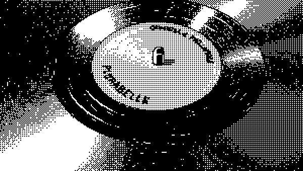
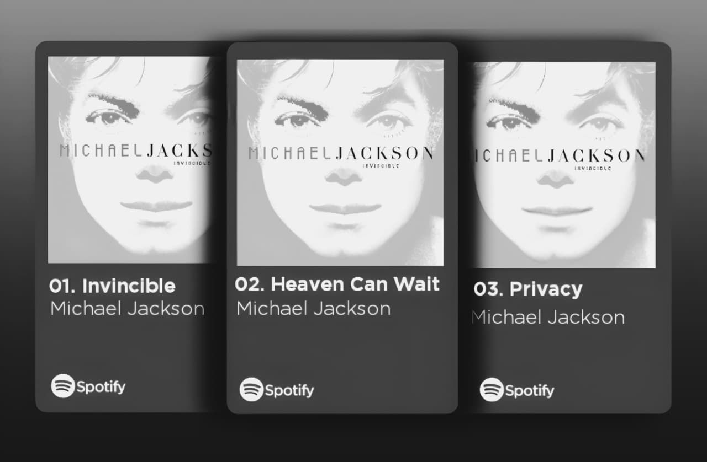

<p align="center">
  
</p>

<div align="center">
  
</div>

<p align="center">
  <sub><sup>S C U D E R I A &nbsp; D E V &nbsp; — &nbsp; L O N D R I N A &nbsp; / &nbsp; P R</sup></sub>
</p>

<div align="center">
  
</div>

<br>

<div align="center">


</div>


<h3 align="center"><sub> 𝐒 𝐎 𝐁 𝐑 𝐄 &nbsp; 𝐌 𝐈 𝐌</sub></h3>

<table align="center" style="border: none;">
<tr style="border: none;">
<td width="60%" style="border: none;">

Nome → João Lucas
Base → Londrina, PR
Equipe → Unicesumar
Motor → VSCode
Stack → JS · HTML · CSS · Java · C
Foco → Evolução constante

Estudante de programação e designer gráfico.
Unindo código com estética, identidade e arte.
Sempre em movimento. Apenas faço aquilo que eu gosto.
</td>

<td width="40%" align="center" style="border: none;">
  
</td>

</tr>
</table>


<div align="center">

<sub>
M A I S &nbsp; T O C A D A S — M I C H A E L &nbsp; J A C K S O N
</sub>

<br>


</div>

<table align="center">
<tr style="border: none;">

<td width="60%">

```
— FREQUÊNCIAS ———————————————————————————————————————————————
  01   Invincible                          Michael Jackson     04:46

  𝑺𝒉𝒆'𝒔 𝒊𝒏𝒗𝒊𝒏𝒄𝒊𝒃𝒍𝒆 
  𝑰 𝒄𝒂𝒏 𝒅𝒐 𝒂𝒏𝒚𝒕𝒉𝒊𝒏𝒈 
  𝑺𝒉𝒆'𝒔 𝒊𝒏𝒗𝒊𝒏𝒄𝒊𝒃𝒍𝒆 
  𝑬𝒗𝒆𝒏 𝒘𝒉𝒆𝒏 𝒊 𝒃𝒆𝒈 𝒂𝒏𝒅 𝒑𝒍𝒆𝒂𝒅 
  𝑺𝒉𝒆'𝒔 𝒊𝒏𝒗𝒊𝒏𝒄𝒊𝒃𝒍𝒆 
  𝑮𝒊𝒓𝒍 𝒘𝒐𝒏'𝒕 𝒈𝒊𝒗𝒆 𝒊𝒏 𝒕𝒐 𝒎𝒆 
  𝑺𝒉𝒆'𝒔 𝒊𝒏-𝒔𝒉𝒆'𝒔 𝒊𝒏𝒗𝒊𝒏𝒄𝒊𝒃𝒍𝒆 
  𝑾𝒆𝒍𝒍, 𝒘𝒆𝒍𝒍 𝑺𝒆𝒆 
  𝑾𝒆𝒍𝒍, 𝒘𝒆𝒍𝒍
  ─────────────────────────────────────────────────────────
  02   Heaven Can Wait                     Michael Jackson     05:05

  𝑻𝒉𝒆𝒍𝒍 𝒕𝒉𝒆 𝒂𝒏𝒈𝒆𝒍𝒔, "𝑵𝒐" 
  𝑰 𝒅𝒐𝒏'𝒕 𝒘𝒂𝒏𝒕 𝒕𝒐 𝒍𝒆𝒂𝒗𝒆 𝒎𝒚 𝒃𝒂𝒃𝒚 𝒂𝒍𝒐𝒏𝒆 
  𝑰 𝒅𝒐𝒏'𝒕 𝒘𝒂𝒏𝒕 𝒏𝒐𝒃𝒐𝒅𝒚 𝒆𝒍𝒔𝒆 𝒕𝒐 𝒉𝒐𝒍𝒅 𝒚𝒐𝒖 
  𝑻𝒉𝒂𝒕'𝒔 𝒂 𝒄𝒉𝒂𝒏𝒄𝒆 𝒊'𝒍𝒍 𝒕𝒂𝒌𝒆 𝑩𝒂𝒃𝒚, 𝒊'𝒍𝒍 𝒔𝒕𝒂𝒚 
  𝑯𝒆𝒂𝒗𝒆𝒏 𝒄𝒂𝒏 𝒘𝒂𝒊𝒕.
  ─────────────────────────────────────────────────────────
  03   Privacy                             Michael Jackson     04:50

  𝑰 𝒏𝒆𝒆𝒅 𝒎𝒚 𝒑𝒓𝒊𝒗𝒂𝒄𝒚 
  𝑺𝒐 𝒑𝒂𝒑𝒂𝒓𝒂𝒛𝒛𝒊 𝑮𝒆𝒕 
  𝒂𝒘𝒂𝒚 𝒇𝒓𝒐𝒎 𝒎𝒆
—————————————————————————————————————————————————————————————
```

</td>

<td width="40%" align="center">
  
</td>

</tr>
</table>


<div align="center">

*"I'm starting with the man in the mirror."*

`INVINCIBLE · SCUDERIA DEV · LONDRINA`

</div>